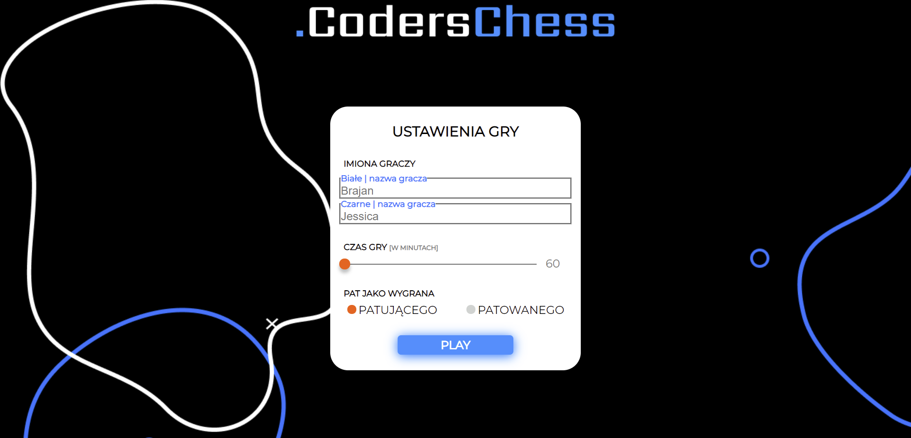
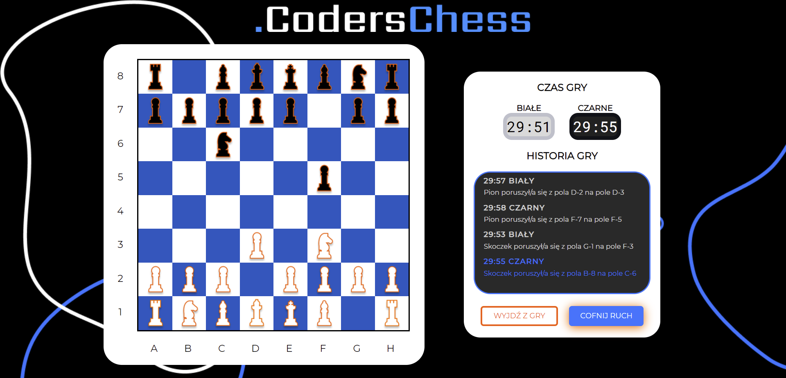
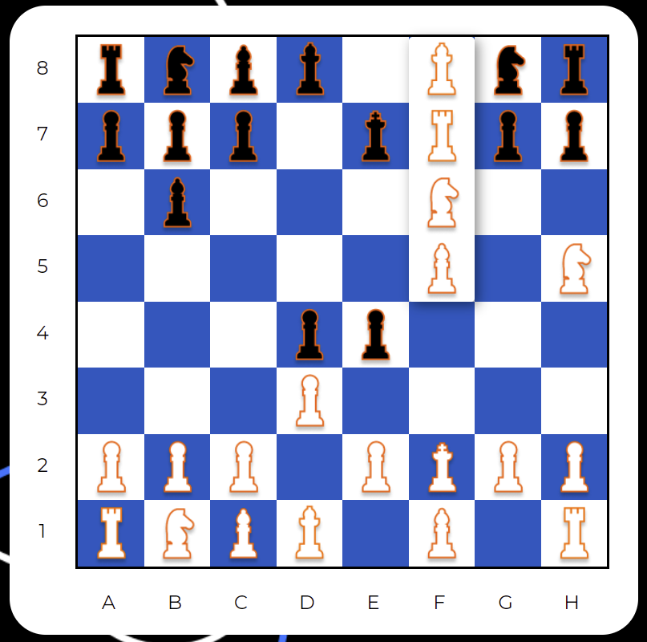

# CodersChess #CODERSCAMP2020
Celem projektu było stworzenie gry w szachy zgodnie z identyfikacją wizualną stowarzyszenia - [Brand Book](https://www.behance.net/gallery/94155751/Brand-Book-Project). W projekcie wykorzytano następujące technologie:
- TypeScript, 
- JavaScript, 
- CSS, 
- Webpack.
! no React, Angular or style library was used for implementation!

### Menu główne
W menu startowym gracze posiadają możliwość personalizacji gry poprzez wybór:
- wersji językowej gry,
- imion/nick'ów graczy,
- czasu gry (60-180 min),
- sytuacji patowej - jako wygranej patującego lub patowanego.

## Gra w szachy

### Lista zaimplementowanych funkcjonalności:
1. Ruchy wszystkich bierek (wykonanie ruchu, jak i pokazywanie możliwych):
   - Pionek
   - Hetman
   - Wieża
   - Goniec
   - Król.
2. Bicie (pokazanie możliwości bicia).
3. Promowanie pionka na dowolną inną figurę (oprócz króla) na końcu planszy.

4. Roszada
5. Szachowanie króla
6. Szach mat
7. Kończenie gry przez Pat
8. Bicie w przelocie
9. Możliwość cofania poprzedniego ruchu.

### Dodatkowe funkcjonalności:
1. Tekstowe komentarze do gry
2. Odliczanie czasu gry dla każdej ze stron
3. Kończenie gry przez limit czasowy - gracz, któremu skończył się czas przegrywa. 
4. Dwie wersje językowe gry — polska i angielska.

  
## Responsywność aplikacji
- Monitory minimalna szerokość 1600px
- Monitory maksymalna szerokość 1600px
- Tablet
- Smartfon

### Zespół:

Mentor: Piotr Bocian 
Członkowie zespołu: Jan Eliasz, Adam Połynka, Szymon Suchodolski, Daria Torz, Klaudia Wojciechowska, Łukasz Żurawski.

Launch date: 15/02/2020